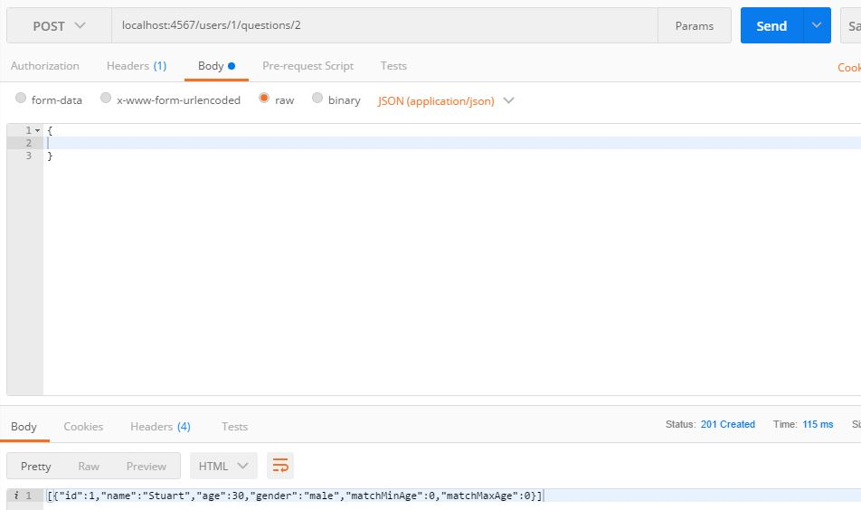
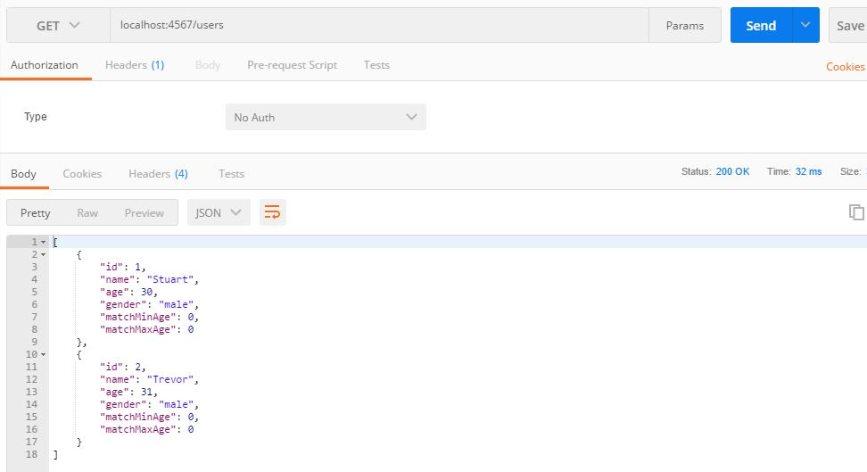
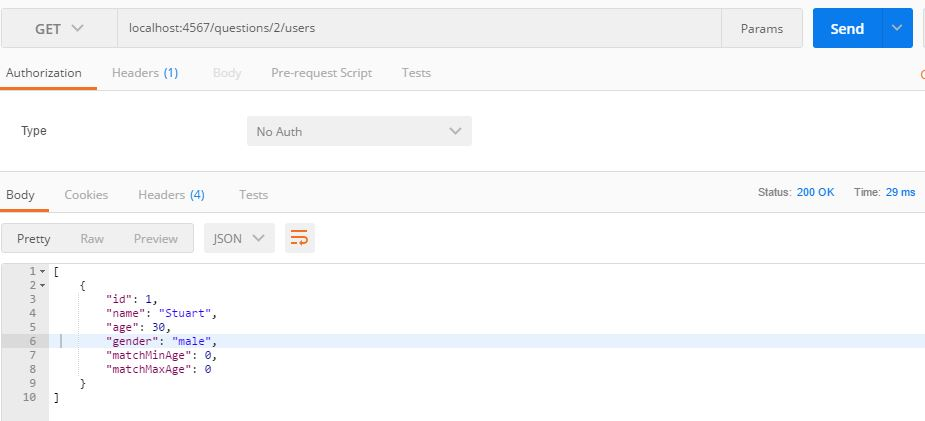
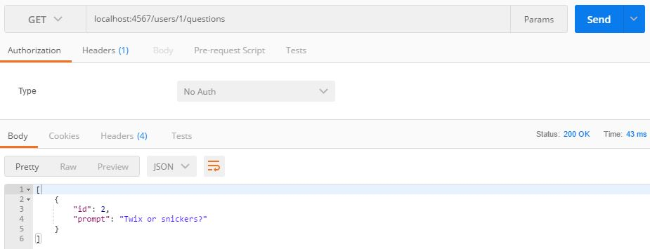

# Dating Website API project

#### Exploring APIs through RESTFUL routing, August 2017

#### By Trevor Gill

## Description

RESTful routing to allow for accessing of dating website API. Users can access information about users, questions asked to to users, and date reviews through the API.

## Setup/Installation Requirements

* Clone the repo
* Run App.java
* Run Postman
* Enter REST routes as defined in App.java

## Specifications

| Behavior      |
| ------------- |
| The user shall be able to create a new dating app user |
| The user shall be able to view details of a specific dating app user |
| The user shall be able to view details of all dating app users |
| The user shall be able to create a new dating app question |
| The user shall be able to view details of a specific dating app question |
| The user shall be able to view the details of all dating app questions |
| The user shall be able to link questions and users via a many-to-many relationship |
| The user shall be able to create a new dating app date review |
| The user shall be able to view details of all dating app date reviews |

## Screenshots
_Create new user_

_Create new question_

_Create new date review_

_Link user and question_

_Get all users_

_Get all date reviews_

_Get specific user_

_Get all users who answered specific question_

_Get all questions answered by specific user_

# Known Bugs

Date review "content" property currently not showing up in JSON get requests.

## Technologies Used

Java, IntelliJ, Postman, H2 mode-postgreSql

### License

Copyright &copy; 2017 Trevor Gill
