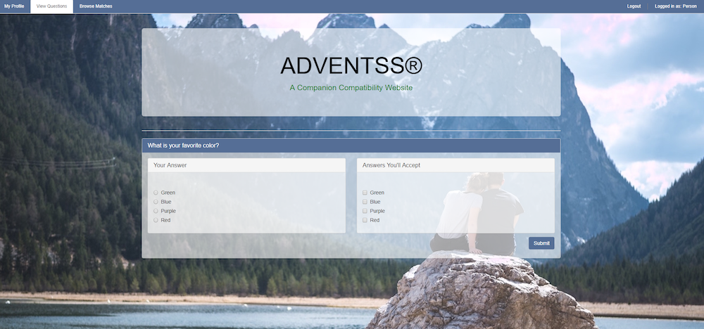

# Dating Website Java Group Project

#### Dating Application, August 2017

#### By Kim Lu, Shaymal Punekar, Stephanie Mayer and Trevor Gill


## Table Of Contents

* [Description](#description)
* [View Of Application](#view-of-application)
* [Set-Up Requirements](#setup-requirements)
* [User Stories](#user-stories)
* [Questions or Concerns](#questions-or-concerns)
* [Known Bugs](#known-bugs)
* [Technologies Used](#technologies-used)

## Description

_This application allows for a user to sign up for an account. You are able to update your profile and login(validated). It allows for a user to match up with another user based on questions that are answered and the compatibility score that is given based on questions answered/accepted._


## Setup Requirements
* You will need Gradle installed on your device.

* Clone the repo from git hub.

* Open in your favorite IDE/editor, this one was created in IntelliJ.
  * [IntelliJ](https://www.jetbrains.com/idea/)

* Run the application, using the green go button at the top.

* Open your preferred browser and navigate to:
````
localhost:4567
````
* Experiment to change the application to your desire.

## User Stories
* As a user, I want to be able to create a new account for a new user.
* As a user, I want to be able to view the details of a specific user.
* As a user, I want to be able to view the details of all the users that I match with.
* As a user, I want to be able to the view the details of a specific dating application question.
* As a user, I want to be able to view the details of all dating application questions.
* As a user, I want to be able to find the compatibility with another user, based off questions answered.
* As an Admin, I want to be able to create new questions for users to answer.


# Screenshots
## Login

## Register New User

## Checkout what your profile looks like


## User can answer new question

## What the users screen looks like when all questions are answered.

## Compare Compatibility with other users

## When a user has no current matches


## Admin is able to create a new question


# Known Bugs
_There are no known bugs at this time_


# Questions or Concerns
* "Stephanie Mayer" <smayer0926@gmail.com>
* "Trevor Gill" <trevor.gill@gmail.com>
* "Shyamal Punekar" <shyamal.Punekar@gmail.com>
* "Kimberly Lu" <kimlu4@comcast.net>


## Technologies Used

* _Java_
* _IntelliJ_
* _Spark_
* _MySQL_
* _Atom_
* _HandleBars_


### License

Copyright &copy; 2017 Kim Lu, Shaymal Punekar, Stephanie Mayer and Trevor Gill
