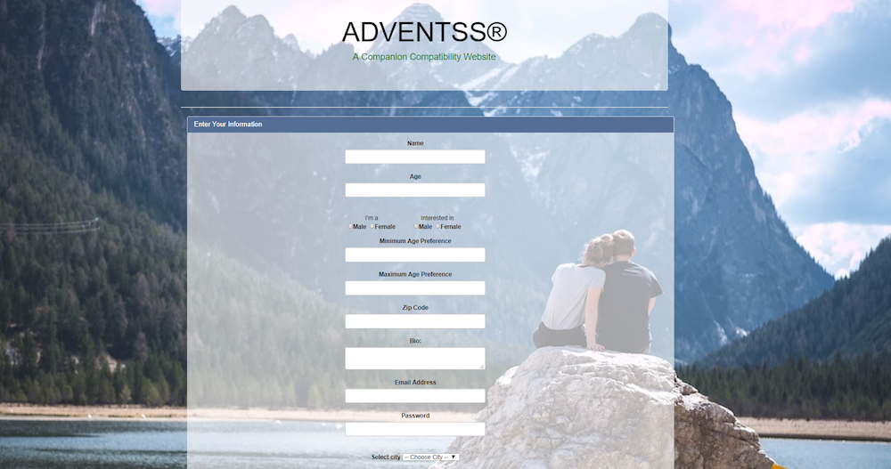
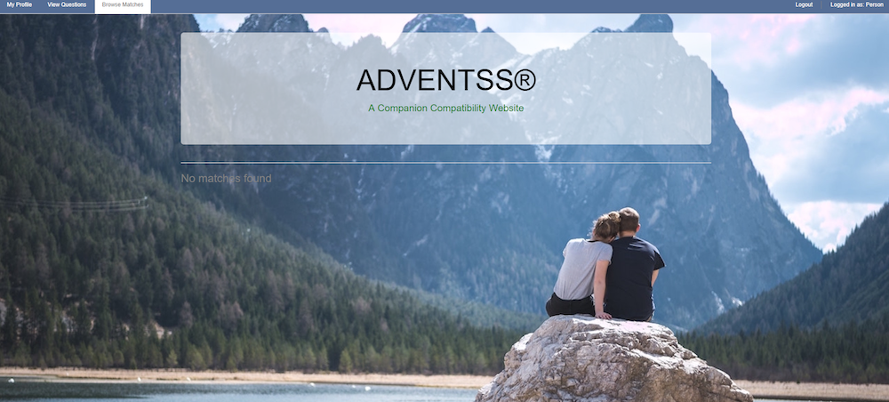

# Dating Website Java Group Project

#### Dating Application, August 2017

#### By Kim Lu, Shaymal Punekar, Stephanie Mayer and Trevor Gill

## Description

_An Application that will allow users to be matched with eachother based on their compatibility. This application uses Java and techniques such as RESTful routing._

## Setup/Installation Requirements
* Clone the repo
* Run App.java
* Go to 'localhost:4567' to launch the application
* Use the application to find the perfect match.

## Specifications

| Behavior      |
| ------------- |
| The user shall be able to create a new dating app user |
| The user shall be able to view details of a specific dating app user |
| The user shall be able to view details of all dating app users |
| The admin shall be able to create a new dating app question |
| The user shall be able to view details of a specific dating app question |
| The user shall be able to view the details of all dating app questions |
| The user shall be able to find compatibility with another user by answering questions|

# Screenshots
##Login

##Register new user

##Checkout Your Profile

##Create new question

##Answer questions

##When all Questions are answered

##Check out Compatibility

##When a person has no matches

# Known Bugs
_There are no known bugs at this time_

## Technologies Used

* Java
* IntelliJ
* Spark

### License

Copyright &copy; 2017 Kim Lu, Shaymal Punekar, Stephanie Mayer and Trevor Gill
